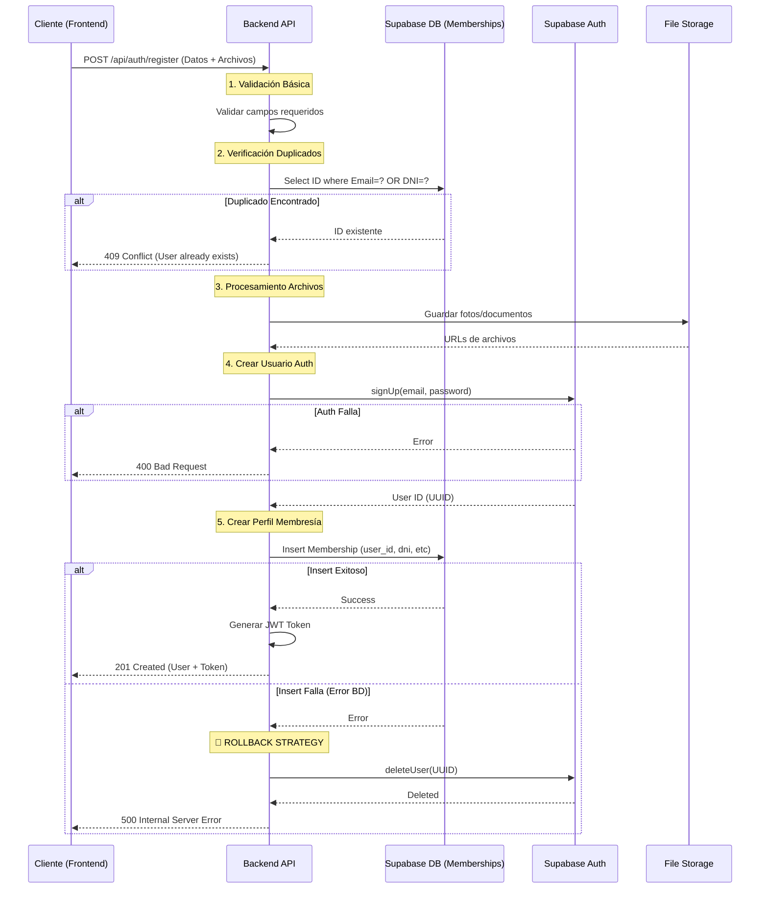

# Flujo de Registro y Autenticación

Este documento describe el flujo de registro de usuarios implementado en el backend, incluyendo la validación de duplicados y la estrategia de consistencia de datos (rollback).

## Diagrama de Secuencia



## Detalles de Implementación

### Validación de Duplicados
Se realiza una doble verificación:
1.  **Endpoint de Pre-chequeo (`/api/auth/check-duplicate`)**: Permite al frontend validar en tiempo real si el DNI o Email ya están en uso antes de enviar el formulario completo.
2.  **Verificación en Registro**: Antes de intentar crear el usuario en Auth, se consulta la tabla `memberships`. Si existe coincidencia de DNI o Email, se rechaza la petición.

### Estrategia de Consistencia (Rollback Manual)
Supabase no soporta transacciones distribuidas nativas entre el servicio de Autenticación y la Base de Datos desde el cliente JS. Para mitigar inconsistencias (ej: Usuario creado en Auth pero fallo al crear perfil en DB):

1.  Se crea el usuario en **Auth**.
2.  Se intenta crear el registro en **Memberships**.
3.  Si la inserción en **Memberships** falla, el backend captura el error y ejecuta automáticamente `supabase.auth.admin.deleteUser(id)` para eliminar el usuario huérfano de Auth.

### Tests de Integración
Se incluye un script de pruebas en `backend/scripts/test-auth-flow.js` que valida:
- Registro exitoso.
- Rechazo de DNI duplicado.
- Rechazo de Email duplicado.
- Consistencia de datos.

Para ejecutar los tests (asegúrese de que el servidor esté corriendo en puerto 3001):
```bash
node scripts/test-auth-flow.js
```
